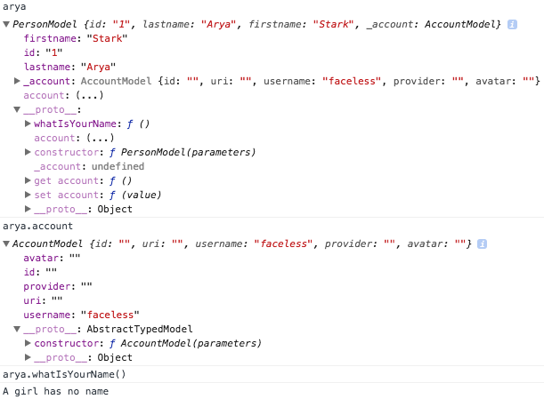

<pre>
 _____  _____                    _ 
|_   _||_   _|                  | |
  | |___ | |_   _ _ __   ___  __| |
  | / __|| | | | | '_ \ / _ \/ _` |
  | \__ \| | |_| | |_) |  __/ (_| |
  \_/___/\_/\__, | .__/ \___|\__,_|
             __/ | |               
            |___/|_|               
</pre>
[](https://codecov.io/gh/meyacine/ts-typed)
[](https://travis-ci.com/meyacine/ts-typed)
[](https://app.fossa.com/projects/git%2Bgithub.com%2Fmeyacine%2Fts-typed?ref=badge_shield)
# Description
Typed is a lighweight library that aims to add typings at runtime.

# How to use it

Install using npm `$ npm install ts-typed --save` or using `$ yarn add ts-typed --save`

- Using `TypedFactory.create(data, Model)` allows you to return data in a given Model structure

- Using `@Typed` property decorator. 
# Good to know
When fetching data from network on typescript project, the data is typed as Object on the Runtime.
Typescript cares about compilation, but sometimes you need to get typed on the Runtime. 
In order to do that you need to know that the only way is to instantiate typescript class. However the subclasses will not be typed if you dont explicitly instantiate them, that's where `@Typed` is helpfull.

>Notice two recommended things:
>- The use of `Partial` in order get flexible constuctor params.
>- The use of `?` for optional param in order to get also acces the a no params constructor.
```
import { Typed, TypedSerializer } from 'typed';

export class SubClazz {
  numberField: number;
  stringField: string;
  booleanField: boolean;
  constructor(obj?: Partial<SubClazz>) {
    Object.assign(this, obj);
  }
}
```
Without ```@Typed``` decorator :
```
class SuperTypeClazz {
  numberField: number;
  stringField: string;
  booleanField: boolean;
  complexTypeField: SubClazz;

  constructor(obj?: Partial<SuperTypeClazz>) {
    Object.assign(this, obj, {
      complexTypeField : new SubClazz(obj?.complexTypeField)
    });
  }
}
```
With ```@Typed``` decorator :
```
class SuperTypeClazz {
  numberField: number;
  stringField: string;
  booleanField: boolean;
  
  @Typed(SubClazz);
  complexTypeField: SubClazz;

  constructor(obj?: Partial<SuperTypeClazz>) {
    Object.assign(this, obj);
  }
}
```
# Serialization
Since @Typed rewrites Getter and Setter and renames the property with an underscore `_` prefix. Sometime it can be touchy to get this when sending data to the server.
That's why ts-typed provides the `TypedSerializer.serialize` method. You only have to define the toJSON method like the example below :
# Example
```
import { Typed, TypedSerializer } from 'typed';

abstract class AbstractTypedModel{
}

export class AccountModel extends AbstractTypedModel {

  id: string;
  uri: string;
  username: string;
  provider: string;
  avatar: string;

  constructor(parameters?: Partial<AccountModel>) {
    super();
    const {id, uri, username, provider, avatar} = parameters;
    this.id = id;
    this.uri = uri;
    this.username = username;
    this.provider = provider;
    this.avatar = avatar;
  }
}

export class PersonModel {

  id: string;
  lastname: string;
  firstname: string;

  @Typed(AccountModel)
  account: AccountModel;

  constructor(parameters?: Partial<PersonModel>) {
    const {id, lastname, firstname, account} = parameters;
    this.id = id;
    this.lastname = lastname;
    this.firstname = firstname;
    this.account = account;
  }

  whatIsYourName(): void {
    console.log('A girl has no name');
  }

  toJSON(): PersonModel {
     return TypedSerializer.serialize(this);
  }
}
```

Using this way, you'll be sure to get the model at runtime, and then call method, get subtypes, etc.
